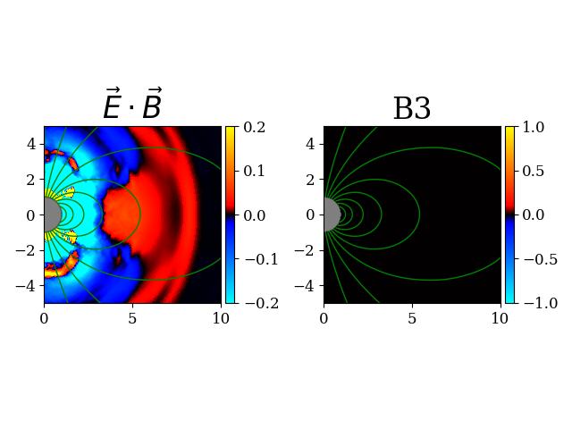

# Aperture_plotting

## current issues to resolve
Any other type of plot you add will also get post processing. consider when adding post you specify what it's added to

## Example use case
```python
import plotting
from plotting import apt_fig
import matplotlib.pyplot as plt
data = plotting.DataSph('[path to data folder]/data/')
```
```python
plt.ioff() # Stops duplicate showing
afig = apt_fig(data,"afig")

afig.add_plot("EdotB")
afig.add_plot("B3")
afig.add_post(["draw_field_lines1", "draw_NS"])

afig.add_parameters("all", xlim = [0,10], ylim = [-5,5]
                    , title_fontsize = 24, tick_fontsize=12
                    , vmin = -0.2, vmax = 0.2)
afig.add_parameters("B3", vmin = -1, vmax = 1)

afig.step = 100

afig.make_fig(fontsize=12)
```



## Structure of the code

There are four main classes in the code: apt_fig, apt_plot, apt_post, DataSph/Data


## `apt_fig` Class

The `apt_fig` class is the central class responsible for creating figures. It manages the data object and orchestrates the plotting functions of `apt_plot` and `apt_post` objects.

### Creating `apt_fig` Objects
Call the `apt_fig` class to create a new figure object. 
- `data`: The data object that contains the information to be plotted.
- `unique_ident` (optional): A unique identifier for the figure. used to delete the previous figure when redefining the same class object. if not provided it  overwrite the previous default `apt_fig` object
```python
afig = apt_fig(data, "afig",**kwargs)
```
### `apt_fig` Attributes
#### User Attributes
Use these to directly change aspects of the figure without resorting to functions. (Note that changing this you will still need to call `make_fig` to apply the changes)

- `data`: The data object that contains the information to be plotted.
- `plots`: A dictionary of `apt_plot` objects that are part of the figure. Use `afig.plots["key"]` to access the `apt_plot` object. Do not add or remove plots directly, use the `add_plot`, `del_plot` methods.
- `post_process`: A dictionary of `apt_post` objects for post-processing steps. Do not add or remove directly, use the `add_post`, `del_post` methods.
- `fig`: The matplotlib figure object.
- `step`: The step number that the data is loaded as. changing this auto reloads the data.
- `parameters`: A dictionary of parameters that define the figure parameters and override (not overwrite) the default parameters of the `apt_plot` objects.

#### Internal Attributes
Do not change these directly.
- `unique_ident`: A unique identifier for the figure. used to delete the previous figure when redefining the same class object
- `made`: A boolean that is true if make_fig has been called.
- `columns`: The number of columns in the figure grid.
- `rows`: The number of rows in the figure grid.
- Additional parameters that functions may add to internally track their workings.


### `apt_fig` Methods

#### `add_plot(plot, pos=None)`:
Adds a plot to the figure. Saves the `apt_plot` object in the `plots` dictionary.

- **Parameters:**
  -  `name`: an `apt_plot` object, a string corresponding to an `apt_plot` object in `apt_plot_types`, or a string corresponding to a field value in the `data` object (e.g., `"B3"` refers to `data.B3`).

  - `pos` (optional): Specifies the grid position of the plot in the figure as a tuple (e.g., `(0, 1)` for first row, second column). The default is `None`, which adds the plot to a new column.

  - `plot_function` (optional: Default "colorplot"): The function to use to plot the data. This is used when wanting to plot a function from the data.keys without having to make an entirely new function for each one.

  - `datakey` (optional): The key of the data object to plot, defaults to apt_plot_obect. This is used for example when wanting to plot both a pcolormesh of data.B3 and an equator lineplot of B3, so the input name must be different to differentiate.

  - `kwargs`: Additional arguments to override the parameters of the `apt_plot` object.
  
- **Returns:** None.
- **Example Use**
```python
afig.add_plot("B3", pos=(0, 1))
```

#### `add_post(apt_post_obj)`:
Adds a post-processing step to the figure. Saves the `apt_post` object in the `post_process` dictionary.
- **Parameters:**
  - `apt_post_obj`: a list or a single entry of `apt_post` objects or strings corresponding to an `apt_post` object in `apt_post_types`.
  - `kwargs`: additional arguments to override the parameters of the `apt_post` object.

- **Returns:** None.
- **Example Use**
```python
afig.add_post(["draw_field_lines1", "draw_NS"])
```

#### `add_parameters(plots)`:
Adds parameters to the figure. These parameters overwrite the default parameters of the `apt_plot` objects.
- **Parameters:**
  - `plots`: a string corresponding to an `apt_plot` object in `apt_plot_types`, a list of strings corresponding to multiple `apt_plot` objects, or `"all"` to apply to all plots.
  - `kwargs`: Whatever parameters you want to pass to overwrite the default parameters of the `apt_plot` objects.

#### `make_fig()`:
Creates the figure based on the added plots and post-processing steps.
- **Parameters:** 
  - `step` (optional): The step number to plot, overwrites `afig.step`.
  - `kwargs`: Additional arguments to override (not overwrite) the parameters of the `apt_plot` and `apt_post` objects.
- **Returns:** The matplotlib figure.

- **Example Use**
```python
afig.make_fig(fontsize=12)
```

#### `update_fig(step,set_plot_attr)`:
Updates the figure based on a new step. Does not quite work if you change a bunch of attributes, in those cases just call make_fig again.

- **Parameters:** 
  - `step` (optional): The step number to plot.
  - `set_plot_attr` (optional): True/False to update the plot attributes like vmin, vmax, etc. Default is False so it will not have to redraw these attributes
- **Returns:** The updated matplotlib figure.

- **Example Use**
```python
afig.update_fig(60)
```

#### `make_movie(save_name, start, end, increment)`:
Creates a movie of the figure based on a range of steps and saves it in the movies folder.

- **Parameters:** 
  - `save_name` (default: Untitled): The name of the movie file.
  - `start` (optional): The starting step number. Defaults to 0.
  - `end` (optional): The ending step number. Defaults to the last step in the data.
  - `increment` (optional): The step increment. Defaults to 1.
- **Returns:** None.
- **Creates** a .mp4 file in the movies folder.
- **Example Use**
```python
afig.make_movie("Example_movie")
```

### Other `apt_fig` Methods
#### External Use:
- `del_plot(name)`: Deletes a plot from the figure.
- `move_plot(name, pos)`: Moves a plot to a new position in the figure.
- `rescale_figure(target_size)`: Rescales the figure to the target size, maintaining the aspect ratio.

#### Internal Use (probably should not be used directly):
- `override_params()`: returns the parameters of the figure, overriding (not overwriting) the default parameters of the `apt_plot` objects.

- `check_position_taken(pos)`: Checks if a position in the figure grid is already taken.

- `resize_row_col(pos)`: Resizes the num_col and num_row if the input position is larger than the current size.

- `set_fig_shape(num_rows,num_columns)`: creates a new figure with the specified number of rows and columns, copies over all existing axes, then deletes the old figure.

- `construct_plot_obj(key)`: Constructs an `apt_plot` object based on the key value. key needs to be a key of the data object

- `set_fontsize()`: Sets the fontsizes of everything based on kwargs and the parameters of the individual objects. 


## `apt_plot` Class

The `apt_plot` class is responsible for creating a singular subplot in the figure. It contains the plotting function and the parameters for the plot.

### Creating `apt_plot` Objects
You don't directly create `apt_plot` objects. Instead, you add them to an `apt_fig` object using the `add_plot` method and a constructor key value or function.

### `apt_plot` Attributes

#### User Attributes
Use these to access and change attributes of the plot.
- `parameters`: A dictionary of parameters that define the plot. Get's overridden (not overwritten) by the `apt_fig` object's parameters. Set new parameters with the `add_parameters` method of the `apt_fig` object, or directly with `afig.plots["[plot_key"].parameters["key"] = value`.

- `ax`: The matplotlib axis object. Access this to directly change things with matplotlib methods (e.g., `afig.plots["plot_key"].ax.set_title("New Title")`).

- `plot_object`: The plot object that is being plotted. (e.g. a QuadMesh from pcolormesh) Do not change this directly, only use to access the plot object.


#### Internal Attributes
Do not change these directly. Please use the `apt_fig` object functions to change these.

- `func`: A lambda function of the form func(data). This is set by the plot constructor function and defines the specific data to plot

- `plot_function`: This is the specific plotting function (e.g., colorplot which calls pcolormesh and sets the colorbar). This is set by the plot constructor function. It takes data as an input.

- `name`: The name of the plot. This is set by the plot constructor function. and should also be the string that references the `apt_plot` object.

- `position`: The position of the plot in the figure grid. This is set by the `add_plot` or `move_plot` method of the `apt_fig` object.

- `made`: A boolean that is true if the plot has been made. This is set by the `make_plot` method.

- `plot_type`: The type of plot (e.g. colorplot, lineplot). This is set by the plot constructor function. This is used to determine how to update the plot. 2D colorgrids use set_array, lineplots use set_data, etc.

### `apt_plot` Methods

I believe all of these are internal and should not be used directly. Some of them may work when directyl called but it is not recommended.

- `override_params(kwargs)`: returns the parameters of the figure, overriding (not overwriting) the default parameters of the `apt_plot` objects with kwargs.

- `make_plot(data)`: Makes the plot based on the data object. This runs the `plot_function` function and `set_plot_attr` function.

- `update_plot(data)`: Updates the plot based on a new data object without needing to redraw everything. This is hardcoded for the different `plot_function` functions. Currently only works for colorplot.

- `set_plot_attr()`: Sets the attributes of the plot based on the parameters of the `apt_plot` object and the `apt_fig` object. Currently hardcoded and only works for `['xlim', 'ylim', 'aspect', 'title']` but can be expanded.

- `copy_ax_attr(new_ax)`: Copies the attributes of the current axis to a new axis and overwrites self.ax. Used when resizing the figure. hardcoded to copy `['title', 'xlabel', 'ylabel', 'xlim', 'ylim', 'xscale','yscale']` but can be expanded to other attributes that affect the look of the plot. Try not to set ticks, because rescaling the figure will mess up the ticks and the default is typically used.

- `set_fontsize()`: Sets the fontsize of the plot based on the `self.parameters` and overridden (not overwritten) by the input kwargs (the parameters of the parent apt_fig object). This is hardcoded to set the fontsize of the title, label, legends, and ticks having each default to just fontsize. Parameters that change  the fontsize are as follows: `['fontsize', 'title_fontsize', 'label_fontsize', 'tick_fontsize', 'legend_fontsize', 'ctick_fontsize']`

### Creating a constructor function for apt_plot

The dictionary `apt_plot_types` contains all the default constructor functions for the `apt_plot` objects. You can add new constructor functions to this dictionary.

All data.keys are available as plot_types too even though they are not contained in the dictionary.

The constructor function should have the following structure:
```python
def plot_name(name='plot_name',**kwargs):
    return apt_plot(
                    "fld_data to plot"
                   , name = name
                   , plot_function = "plot_function"
                   , #optional parameters
    )
```
Currently I think this only works for colorplots and plotting things like `data.B3*data.E2`.

**Example constructor function**
```python
def EdotB(name='EdotB',**kwargs):
    vmin = kwargs.get('vmin', -1) #default values
    vmax = kwargs.get('vmax', 1)
    return apt_plot(
                     lambda data: data.E1*data.B1 + data.E2*data.B2 + data.E3*data.B3,
                     name = name,
                     plot_function = colorplot,
                    
                     #optional
                     title = r"$\vec{E} \cdot \vec{B}$",
                     vmin = vmin,
                     vmax = vmax,
                     **kwargs
                     )
apt_plot_types['EdotB'] = EdotB
```

## `apt_post` Class

The `apt_post` class is responsible for post-processing steps in the figure. It contains the post-processing function and the parameters for the post-processing step.

For example drawing field lines belongs in this class

Make objects of this class with a post_constructor function and add them to the `apt_fig` object with the `add_post` method.

### `apt_post` Attributes

#### User Attributes
Use these to access and change attributes of the post-processing step.
- `parameters`: A dictionary of parameters that define the post-processing step. Get's overridden (not overwritten) by the `apt_fig` object's parameters. Set new parameters with `afig.post_process["post_key"].parameters["key"] = value`. will need to call afig.make_fig or afig.update_fig to apply.

#### Internal Attributes
Do not change these directly.

- `post_func`: the function that is called to do the post-processing step. This is set by the post constructor function.

- `update_func` (optional): a function that is called to update the post-processing step. This is set by the post constructor function. (afig.update_fig will call this function if it exists)

- `name`: The name of the post-processing step. use this as the key to access (e.g `afig.post_process[name]) This is set by the post constructor function.

### `apt_post` Methods

I believe all of these are internal and should not be used directly. Some of them may work when directly called but it is not recommended.

- `override_params(kwargs)`: returns the parameters of the figure, overriding (not overwriting) the default parameters of the `apt_post` objects with kwargs.

- `make_post(apt_fig_obj)`: Makes the post-processing step based on the `apt_fig` object. This runs the `post_func` function.

- `update_post(apt_fig_obj)`: Updates the post-processing step based on the `apt_fig` object without needing to redraw everything. If the `update_func` function exists, it will be called.

- `set_fontsize()`: exists but doesn't do anything yet. Will need to be able to change say text_fontsize for post processing text functions or legend_fontsize.

### Creating a constructor function for apt_post

The dictionary `apt_post_types` contains all the default constructor functions for the `apt_post` objects. You can add new constructor functions to this dictionary.

The constructor function should have the following structure:
```python
def post_name(name='post_name',**kwargs):
    
    def func(apt_fig,**kwargs):
        #do something 
        return None
    
    #Optionally add an update function
    def update_func(apt_fig,**kwargs):
        # update the thing you did
        # frequently is just del old object and
        # then recall func
        return None
    return apt_post(
                    name = name
                   , post_func = func
                   , update_func = update_func
    )
apt_post_types['post_name'] = post_name
```

**Example constructor functions**
```python
def draw_field_lines1(name='draw_field_lines1',**kwargs):
    
    def func(apt_fig,**kwargs):
        data = apt_fig.data
        Bp = kwargs.get('Bp',data.conf["Bp"])
        flux    = np.cumsum(data.B1 * data._rv * data._rv * np.sin(data._thetav) * data._dtheta, axis=0)
        clevels = np.linspace(0.0, np.sqrt(Bp), 10)**2
        
        for plot in apt_fig.plots.values():
            contours = plot.ax.contour(data.x1, data.x2, flux, clevels, colors='green', linewidths=1)
            setattr(plot, name, contours)
            # to access for update later
        return None
    
    def update_func(apt_fig,**kwargs):
        
        for plot in apt_fig.plots.values():
            if hasattr(plot, name):
                for c in getattr(plot, name).collections:
                    c.remove()
        func(apt_fig,**kwargs)
            
        if debug.enabled and debug.level <= 1:
            print(f"Updated {name}")
        return None
    
    return apt_post(name, func, update_func, **kwargs)
apt_post_types['draw_field_lines1'] = draw_field_lines1
```
```python
def draw_NS(name='draw_NS',**kwargs):
    def func(apt_fig,**kwargs): 
        r = kwargs.get("Radius",1)
        for plot in apt_fig.plots.values():
            plot.ax.add_patch(plt.Circle((0,0),r,fill=True, color="black", alpha=0.5))

    return apt_post(name, func, **kwargs)
apt_post_types['draw_NS'] = draw_NS
```

## `DataSph` and `Data` Classes

Those defined in the datalib.py and datalib_logsph.py files. These are what handle Aperture's data structures and are used to load the data for the plotting functions.

## Functions not contained in the classes

### `apt_plot` constructor functions
call these with `afig.add_plot("key")` to add one of these to the figure.

Access the dictionary of these functions with `apt_plot_types`

- Any key value in the data object can be used as a plot type. (e.g. "B3" will plot the B3 field from data.B3)

- `EdotB`: Returns the `apt_plot` object for the dot product of the electric and magnetic fields. Uses the `colorplot` function.

- `Epar`: Returns the `apt_plot` object for the component of Electric Field parallel to the magnetic field. Uses the `colorplot` function.

- Other default constructo functions to be added

### `apt_post` constructor functions
call these with `afig.add_post("key")` to add one of these to the figure.

Access the dictionary of these functions with `apt_post_types`

- `draw_field_lines1`: Draws field lines on the plot. Uses the `contour` function. biases towards poles, has `data.conf["Bp"]` as the limit of the flux values. has update function to remove old field lines and redraw new ones.

- `draw_NS`: Draws a gray circle of radius 1 at the origin. does not have an update function.

- Other default constructor functions to be added

### plotting type functions
These are the functions that actually do the plotting. They are inputs into the `apt_plot` constructor functions and are called by the `apt_plot` object's `make_plot` method.

- `colorplot`: Makes a color plot of the data. Uses the `pcolormesh` function and sets the colorbar. saves the colorbar as an attribute of the `apt_plot` object. apt_plot.cbar. This allows a hardcoded updating for fontsize

- Other plotting functions to be added

### Other functions

#### `match_param(parameters, obj)`:
Matches the possible arguments of an obj to a dictionary of parameters. returns a dictionary of whatever paramers can be passed as argument for the object. Does not work with kwargs

#### `extract_keyword_from_error(error)`:
Extracts the keyword that gave an unexpected keyword argument. This is used for the `run_function_safely` function

#### `run_function_safely(func, *args, **kwargs)`:
Tries to run a function with the given arguments. If the function does not accept an argument it will remove the keyword that gave an error and try again. This is used because pcolormesh accepts kwargs, but passes those to quadmesh.set() which runs errors on many possibly parameters.

